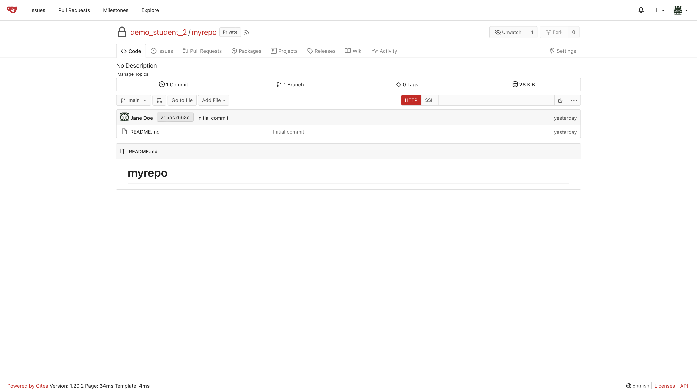
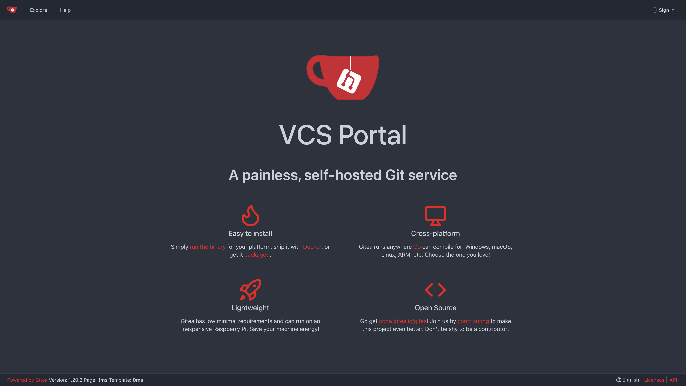

# Gitea-Red

Soft, lite red theme. Utilizes Gitea's default theme but with some colors from the Gitea-Red-Silver fork. Compatible with Dark Reader. If you miss the silver color, you can alternatively use Dark Reader to dim website colors.

## Directions

01. Locate your custom directory: Site Administration > Configuration > Custom File Root Path (e.g., /var/lib/gitea/custom)
02. Verify if a public directory exists within the custom directory
03. If the public directory exists, make sure it contains two directories: css and img
04. If the css and img directories do not exist, then create them
05. To add just the theme (not the red Gitea logos), copy [theme-red.css](./public/css/theme-red.css) into the css directory
06. To add the red Gitea logos, backup any existing img directory, and copy all the [logos](./public/img/) into your img directory
07. Locate your configuration file: Site Administration > Configuration > Configuration File Path (e.g., /etc/gitea/app.ini)
08. Add to the configuration file:
    ```ini
    [ui]
    THEMES = gitea,arc-green,red
    DEFAULT_THEME = red
    THEME_COLOR_META_TAG = none
    ```
09. Restart Gitea

## Photos

[](./screenshots/home_lite.png)
[](./screenshots/repo_lite.png) \
(redacted)

Using Dark Reader web browser extension:
[](./screenshots/home_dark.png) \
Using Dark Reader web browser extension:
[](./screenshots/repo_dark.png) \
(redacted)

## Known Issues

- [x] ~~When you overscroll, still see green color~~ (added `THEME_COLOR_META_TAG` to app.ini)
- [x] ~~With Dark Reader, not the entire page is the same color~~ (replaced `body{}` with `.full.height{}` in theme-red.css)
- [x] Directories sometimes turn blue (~~testing a fix~~ because of Dark Reader and you cleared your browser history, just refresh browser)

Theme coded with &#9829; in VSCodium