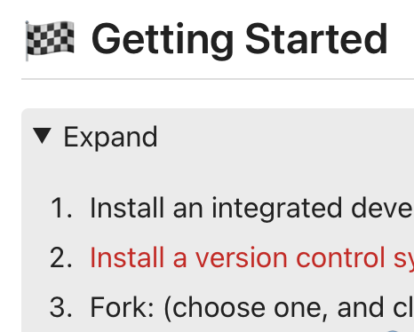
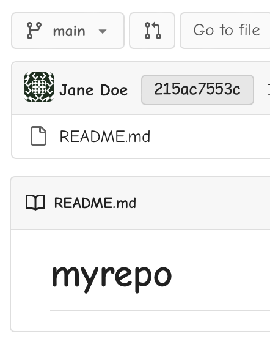
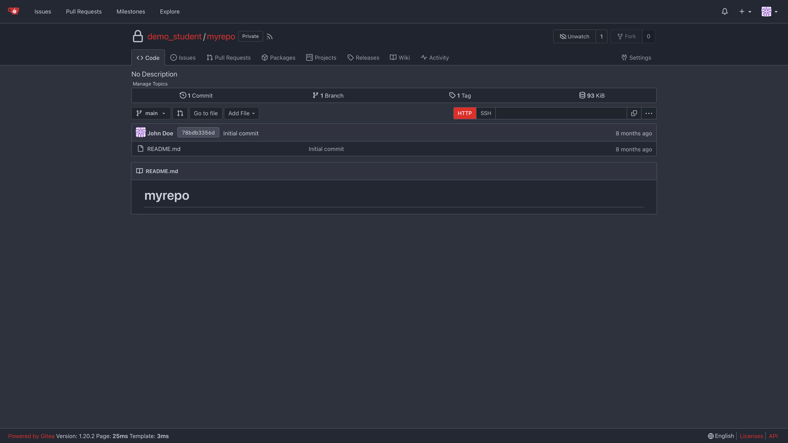
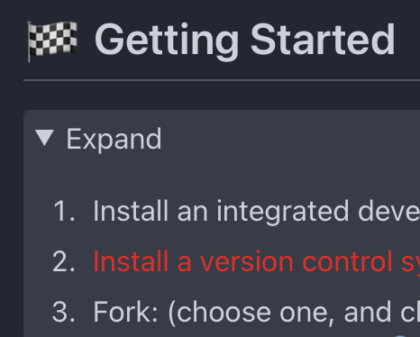
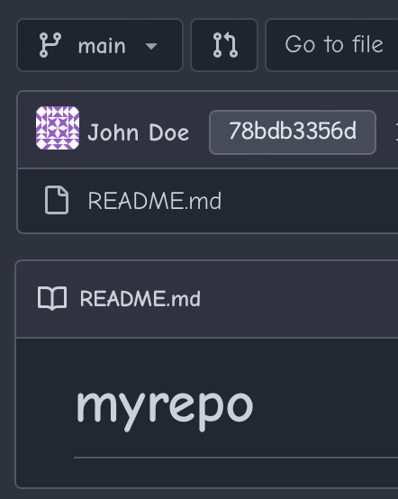

# Gitea-Red

~~Soft~~, Lite and dark red theme. Utilizes Gitea's default themes but with some colors and images from the Gitea-Red-Silver fork.

## Directions

01. Locate your custom directory: Site Administration > Configuration > Custom File Root Path (e.g., /var/lib/gitea/custom)
02. Verify if a public and templates directory exist within the custom directory
03. If the public and templates directory exist, make sure the public directory contains two directories: css and img, and make sure the templates directory contains one directory: base
04. If the css, img and base directories do not exist, then create them
05. To add just the themes (not the red Gitea logos or Comic fonts), copy [theme-auto-red.css](./public/css/theme-auto-red.css), [theme-red.css](./public/css/theme-red.css), and [theme-arc-red.css](./public/css/theme-arc-red.css) into the css directory
06. To add the red Gitea logos, backup any existing img directory, and copy all the [logos](./public/img/) into your img directory
07. To add kid-friendly Comic fonts, copy [head_style.tmpl](./templates/base/head_style.tmpl) into the base directory
08. Locate your configuration file: Site Administration > Configuration > Configuration File Path (e.g., /etc/gitea/app.ini)
09. Add to the configuration file:
    ```ini
    [ui]
    THEMES = auto,gitea,arc-green,auto-red,red,arc-red
    DEFAULT_THEME = auto-red
    ```
10. Restart Gitea
11. Existing users: Go to user Settings > Appearance > change default theme
> Comic fonts (if added) will display automatically.

## Photos

Red (Original) \
 \
 \
(redacted)

<table>
    <tr>
        <td>Stylized collapsible elements:</td>
        <td>Comic fonts:</td>
    </tr>
    <tr>
        <td style="vertical-align: top"></td>
        <td style="vertical-align: top"></td>
    </tr>
</table>

Arc-Red \
 \
 \
(redacted)

<table>
    <tr>
        <td>Stylized collapsible elements:</td>
        <td>Comic fonts:</td>
    </tr>
    <tr>
        <td style="vertical-align: top"></td>
        <td style="vertical-align: top"></td>
    </tr>
</table>

> Disable the Dark Reader web browser extension for your website.

## Known Issue

- [x] Checkmark is not displayed, when fork a repository and select "Make Repository Private." I submitted an issue: [https://github.com/go-gitea/gitea/issues/25076](https://github.com/go-gitea/gitea/issues/25076) Now, a fix is coming: [pull request #25573](https://github.com/go-gitea/gitea/pull/25573). Fixed in [Gitea 1.20.0](https://github.com/go-gitea/gitea/releases/tag/v1.20.0)

Theme coded with &#9829; in VSCodium